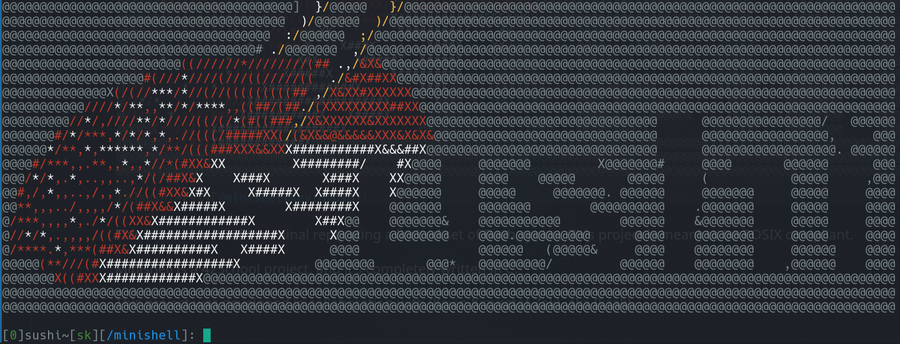

This is Sushi, a POSIX terminal replicating a limited set of Bash syntax. This project is meant to be POSIX compliant.

Minishell is a 42School project, and it's completely written in C.

This project was developed in collaboration with (Kevin Krzysztof Zak), aka (kzak).

